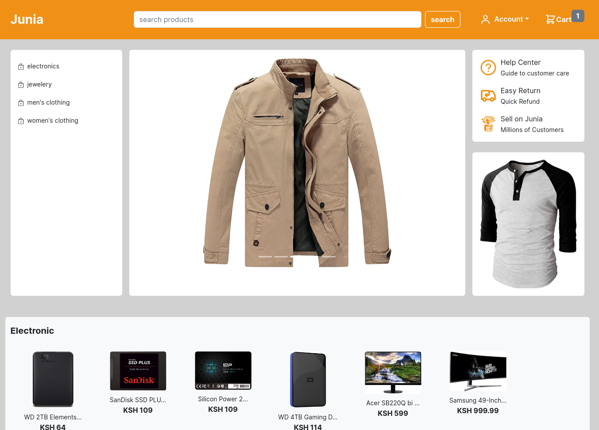
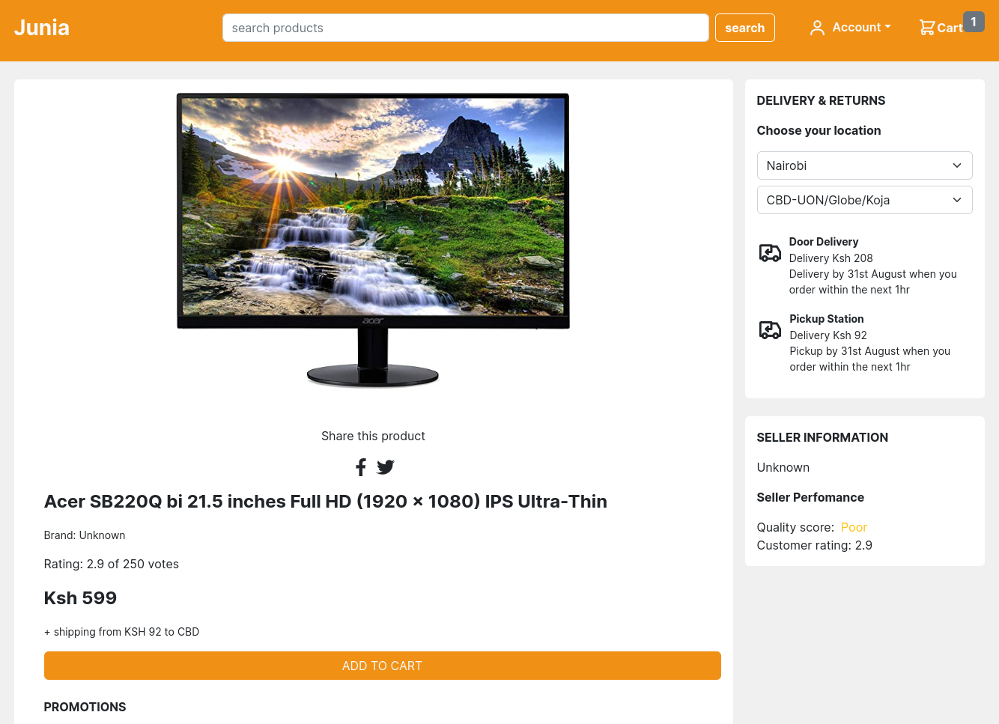
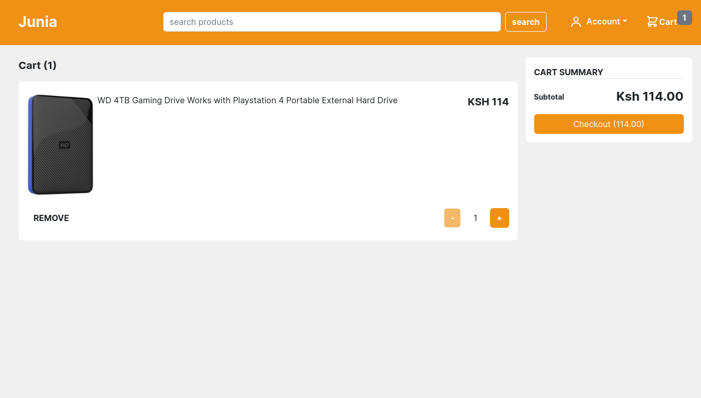
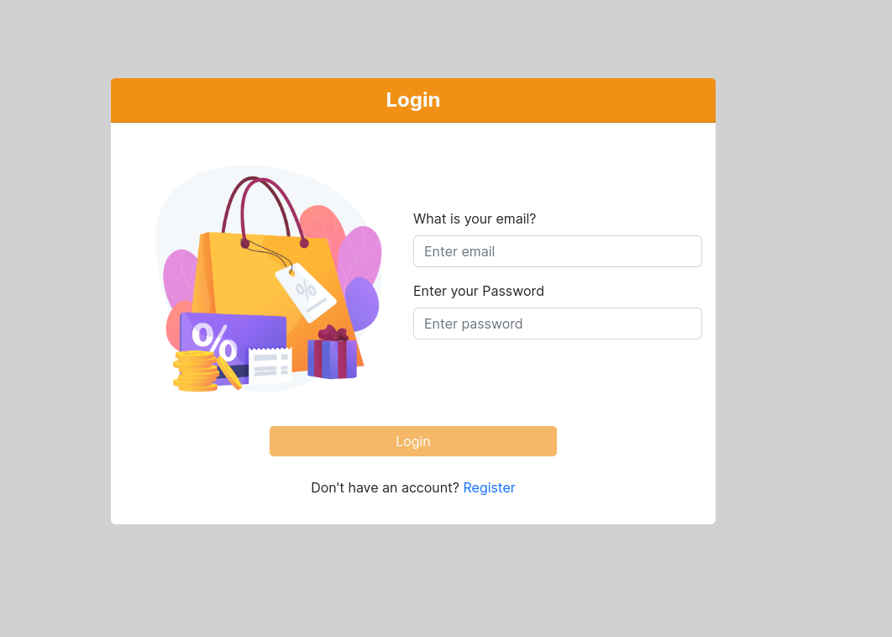

# Imagine Buy

Imagine Buy is an e-commerce web app built on the MERN stack i.e. M - MongoDB, E - Express.js, R - React.js, N - Node.js. Users can view products available for sale, see the description and prices, add the product to the cart, enter shipping address, choose payment method, and then place the order. However, certain actions like entering the shipping address, payment, and placing orders are only allowed for logged-in users. Authentication and Authorization use JSON web tokens, which are generated in the backend and provided when a user enters valid credentials on the login page.



## Getting Started

- Type the following command in your terminal to clone this repository

```
https://github.com/Victoric3/imagine-buy
```

If you are using SSH, use the following command

```
git@github.com:Victoric3/imagine-buy.git
```

When you run the commands successfully, you should have a local version of this repository.

### Prerequisites

- A computer with Node.js installed
- Access to the Internet
- An IDE of your choice e.g., VS Code, Sublime Text, or Atom

### Installing

Before starting the application, navigate into the frontend and backend folders and run `npm install` to install the project dependencies.

Create a `.env` file in the backend project root directory and populate it with:

```
DATABASE_CONNECTION_URI='<your mongodb uri>'
ACCESS_TOKEN_SECRET='<your access token secret>'
REFRESH_TOKEN_SECRET='<your refresh token secret>'
```

To run the web app, navigate inside the frontend folder and run `npm run dev` to start the local server. Then navigate into the backend folder and run `npm start` in your terminal. Both servers should be running for the web app to work. Once the server is running, open your browser and enter `localhost:5173` or the address shown in the terminal running the frontend local server. This will only work on the computer running the server. It is not available to anyone else.

### Starting the Project

1. **Clone the Repository:**
   ```bash
   git clone https://github.com/Victoric3/imagine-buy
   cd imagine-buy
   ```

2. **Install Dependencies:**
   - Navigate to the frontend folder and install dependencies:
     ```bash
     cd frontend
     npm install
     ```

   - Navigate to the backend folder and install dependencies:
     ```bash
     cd ../backend
     npm install
     ```

3. **Set Up Environment Variables:**
   - Create a `.env` file in the backend folder and add your configuration:
     ```env
     DATABASE_CONNECTION_URI='<your mongodb uri>'
     ACCESS_TOKEN_SECRET='<your access token secret>'
     REFRESH_TOKEN_SECRET='<your refresh token secret>'
     ```

4. **Run the Development Servers:**
   - Start the frontend development server:
     ```bash
     cd ../frontend
     npm run dev
     ```

   - Start the backend development server:
     ```bash
     cd ../backend
     npm start
     ```

5. **Access the Application:**
   - Open your browser and go to `http://localhost:5173` (or the address shown in your terminal).

## More Screenshots




## Built With

* [Node.js](https://nodejs.org/en/)
* [Express.js](https://expressjs.com/) - Web framework used in the backend with Node.js
* [React.js](https://reactjs.org/) - Frontend Library to create the UI
* [MongoDB](https://www.mongodb.com/) - Database used (NoSQL)

## Known Bugs
Missing payments. Working on it.

Feel free to submit a pull request or reach out at chukwujiobivictoric@gmail.com.

## Contributing

Feel free to submit a pull request or reach out at chukwujiobivictoric@gmail.com.

## Authors

* **Chukwujiobi victor** - *Initial work* - [Imagine Buy](https://github.com/Victoric3/imagine-buy)

- Linkedin - [chukwujiobi victor](https://www.linkedin.com/in/chukwujiobiv/)

## License

This project is licensed under the MIT License - see the [LICENSE.md](LICENSE) file for details.
